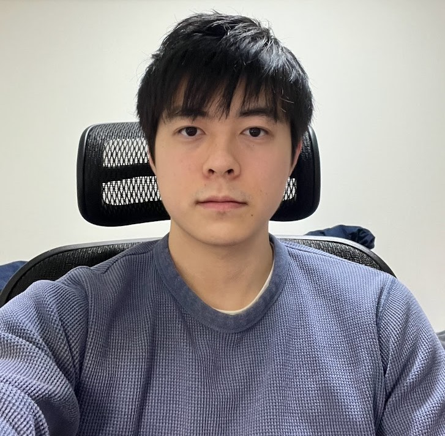

# Yuta Sumiya

## 📌 About Me

During my university years, I was involved in multiple machine learning research projects, with a particular focus on counterfactual explanations, natural language processing through statistical machine learning, and the development of recommendation systems using graph neural networks. Starting in 2024, I will embark on a career as a consultant leveraging data science.

## 📚 Education

- **MSc in Information Science**, University of Electro-Communications Graduate School, Graduate School of Informatics and Engineering, April 2022 - March 2024
- **BSc in Information Systems**, University of Electro-Communications, School of Informatics and Engineering, April 2018 - March 2022

## 📜 Research Achievements

### Journal Publications

1. 住谷祐太, 富川雄斗, 伊藤尚紀, & 高橋里司. "SCTTM によるユーザ属性を考慮した潜在嗜好変化の時系列推定", オペレーションズ・リサーチ= Communications of the Operations Research Society of Japan: 経営の科学 68.2 (2023): 56-66. [[journal link](https://orsj.org/?p=5504)]

### International Conference Proceedings (Peer-reviewed)

1. Y. Sumiya, R. Numata and S. Takahashi. "Pseudo Session-Based Recommendation with Hierarchical Embedding and Session Attributes", in 26th International Conference on Discovery Science, Portugal, October 2023. [[arXiv link](https://arxiv.org/abs/2306.10029)]

### ### Conference Presentations (Non-peer-reviewed)

1. 住谷祐太, 庄野逸. "FastDCFlow: Fast and Diverse Counterfactual Explanations Using Normalizing Flows", The 24th Information-based induction science workshop , 北九州国際会議場, 2023年10月.
2. 住谷祐太, 沼田竜成, 立花展至, 村上諒 & 高橋里司. "セッション属性と商品特徴量の階層埋め込みによる擬似セッションベース推薦", 令和4年度データ解析コンペティション成果報告会, 中央大学後楽園キャンパス, 2023年3月.
3. 住谷祐太, 富川雄斗, 伊藤尚紀, & 高橋里司. "子育て支援 QA サイトにおける潜在嗜好変化の時系列推定". 言語処理学会第 29 回年次大会, 沖縄, 2023年3月.
4. 住谷祐太, 沼田竜成, 立花展至, 村上諒 & 高橋里司. "セッション属性と商品特徴量の階層埋め込みによる擬似セッションベース推薦", 令和4年度データ解析コンペティション最終報告会, 千葉工業大学津田沼キャンパス, 2023年2月.
5. 住谷祐太, 富川雄斗, 伊藤尚紀, 佐々木極昇, 羽田野湧太, 寺崎海翔, 青柳和樹, 荒木麻帆 & 高橋里司. "SCTTM によるユーザ属性を考慮した潜在嗜好変化の時系列推定", 令和3年度データ解析コンペティション成果報告会, オンライン, 2022年3月.
6. 住谷祐太, 富川雄斗, 伊藤尚紀, 佐々木極昇, 羽田野湧太, 寺崎海翔, 青柳和樹, 荒木麻帆 & 高橋里司. "SCTTM によるユーザ属性を考慮した潜在嗜好変化の時系列推定", 令和3年度データ解析コンペティション最終報告会, オンライン, 2022年2月.
7. 住谷祐太, 庄野逸. "反実仮想的なセグメンテーションによる機械学習モデルの解釈", The 24th Information-based induction science workshop , オンライン, 2021年11月.
   

## 🏆 Awards

1. 池澤隆斗, 羽田野湧太, 住谷祐太, 富川雄斗 & 伊藤尚紀. U☆PoC～UECアイディア実証コンテスト～2023, 奨励賞 (2位), 電気通信大学, 2023年9月. [[link](https://www.uec.ac.jp/research/venture/contest.html)]
2. 住谷祐太, 沼田竜成, 立花展至, 村上諒 & 高橋里司. 令和4年度データ解析コンペティション最終報告会, 最優秀賞, 2023年2月. [[link](http://jscs.jp/dac/index.php/meeting/R04meeting)]
3. 住谷祐太. 電気通信大学目黒会賞, 2022年3月. [[link](https://megurokai.jp/home2/category/dosokaisho/)]
4. 住谷祐太, 富川雄斗, 伊藤尚紀, 佐々木極昇, 羽田野湧太, 寺崎海翔, 青柳和樹, 荒木麻帆 & 高橋里司. 令和3年度データ解析コンペティション成果報告会, 審査員特別賞 (3位), 2022年3月. [[link](https://jasmac-j.jimdofree.com/)]
5. 住谷祐太, 富川雄斗, 伊藤尚紀, 佐々木極昇, 羽田野湧太, 寺崎海翔, 青柳和樹, 荒木麻帆 & 高橋里司. 令和3年度データ解析コンペティション最終報告会, 最優秀賞, 2022年2月. [[link](http://jscs.jp/dac/index.php/meeting/R03meeting)]
6. 住谷祐太, 矢田翔大, 東恩納怜也, 長谷川浩生, 中濱雄喜, 青柳和樹, 伊藤尚紀 & 高橋里司. 令和2年度データ解析コンペティション最終報告会, 奨励賞, 2021年2月. [[link](http://jscs.jp/dac/index.php/meeting/R02meeting)]
 
## 💼 Professional Experience

- **Data Scientist**, Cutting-edge Technology Consulting, , Fujitsu Ltd., 2024--

## Part-time Job & Internship Experience
- **Fujitsu Ltd.**: Analysis of text and POS data using data analytics platforms (July 2022 - December 2022, September 2023 - Present)
- **NTT Research**: Construction of network failure classification prediction models (January 2023 - February 2023)
- **Hakuhodo DY Media Partners　Ltd.**: (January 2023)

## 🏅 Competition Achievements

- SIGNATE Exspert [[link](https://signate.jp/users/32973)]
- Kaggle Contributer [[link](https://www.kaggle.com/sumipy)]
- AtCoder Brown [[link](https://atcoder.jp/users/yusumi)]

## 🌐 Contact & Links

- **Email**: sumiya@uec.ac.jp
- **LinkedIn**: [link](https://www.linkedin.com/in/%E7%A5%90%E5%A4%AA-%E4%BD%8F%E8%B0%B7-b4035523a/)
- **GitHub**: [link](https://github.com/sumugit)

---

Looking forward to potential collaborations and discussions!

