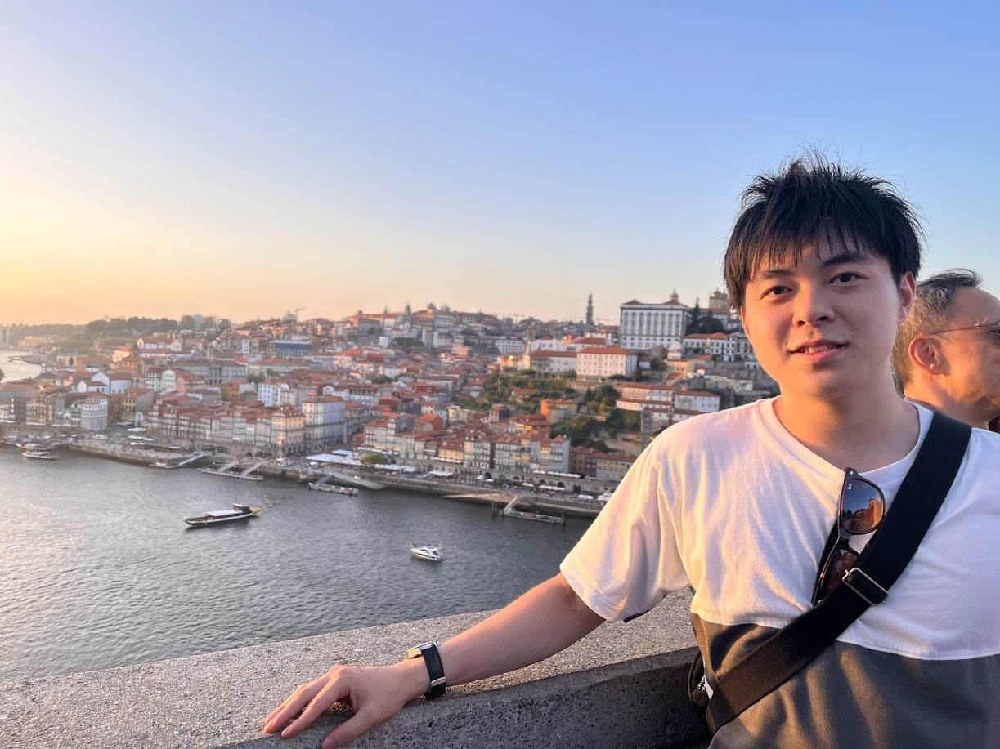

# Yuta Sumiya

  

## 📌 About Me 

My university years were marked by involvement in multiple machine learning research projects, where I particularly focused on counterfactual explanations, statistical machine learning for natural language processing, and the development of recommendation systems using graph neural networks. In 2024, I am set to begin a career in data science consulting, leveraging the expertise I have gained.

## 📚 Education

- **MSc in Information Science**, University of Electro-Communications Graduate School, Graduate School of Informatics and Engineering, April 2022 - March 2024
- **BSc in Information Systems**, University of Electro-Communications, School of Informatics and Engineering, April 2018 - March 2022

## 📜 Research Achievements

### Journal Publications

1. 住谷祐太, 富川雄斗, 伊藤尚紀, & 高橋里司. &quot;SCTTM によるユーザ属性を考慮した潜在嗜好変化の時系列推定&quot;, オペレーションズ・リサーチ= Communications of the Operations Research Society of Japan: 経営の科学 68.2 (2023): 56-66. [[journal link](https://orsj.org/?p=5504)]

### International Conference Proceedings (Peer-reviewed)

1. Yuta Sumiya, Naoyuki Echizenya, Tomoyuki Taguma, Kyosuke Toda, Takahisa Ando, Yoshiaki Oida, Yutaka Takahashi.&quot;Decoding Policy Interactions in System Dynamics: A Balanced Tree Clustering Approach&quot;, International System Dynamics Conference, Boston, USA, August 2025.
2. Y. Sumiya and H. Shouno.&quot;Model-Based Counterfactual Explanations Incorporating Feature Space Attributes for Tabular Data&quot;, IEEE World Congress on Computational Intelligence, Yokohama, Japan, July 2024. [[IEEE Xplore link](https://ieeexplore.ieee.org/document/10651395)] [[arXiv link](https://arxiv.org/abs/2404.13224)]
3. Y. Sumiya, R. Numata and S. Takahashi. &quot;Pseudo Session-Based Recommendation with Hierarchical Embedding and Session Attributes&quot;, in 26th International Conference on Discovery Science, Porto, Portugal, October 2023. [[SpringerLink](https://link.springer.com/chapter/10.1007/978-3-031-45275-8_39)] [[arXiv link](https://arxiv.org/abs/2306.10029)]

### Conference Presentations (Non-peer-reviewed)

1. 山上光平, 横山優一, 住谷祐太, 庄野逸, 水牧仁一朗, 雨海有佑, 大河内拓雄. &quot;Deep prior によるノイズ・アーティファクト除去 ～軟X線角度分解光電子分光法への適用～&quot;, The 26th Information-based induction science workshop, 那覇文化芸術劇場なはーと, 2025年11月.
2. 住谷祐太, 越前谷直之, 田熊知幸, 戸田恭輔, 安藤剛寿, 笈田佳彰, 高橋裕. &quot;システム・ダイナミクスにおける複数施策相互作用を考慮した平衡木クラスタリングによる解釈&quot;, 第39回人工知能学会全国大会, 大阪国際会議場, 2025年5月.
3. 山上光平, 横山優一, 住谷祐太, 庄野逸, 水牧仁一朗, 雨海有佑, 大河内拓雄. &quot;深層学習と組み合わせた超高効率μSX-ARPESの構築:μSX-ARPESへの実装&quot;, 第38回日本放射光学会年会放射光科学合同シンポジウム, 仙台国際センター, 2025年1月.
4. 住谷祐太, 庄野逸. &quot;テーブルデータにおける入力空間の特徴を考慮したモデルベース反実仮想説明&quot;, 電子情報通信学会総合大会 , 広島大学東広島キャンパス, 2024年3月.
5. 住谷祐太, 庄野逸. &quot;FastDCFlow: Fast and Diverse Counterfactual Explanations Using Normalizing Flows&quot;, The 24th Information-based induction science workshop, 北九州国際会議場, 2023年10月.
6. 住谷祐太, 沼田竜成, 立花展至, 村上諒 & 高橋里司. &quot;セッション属性と商品特徴量の階層埋め込みによる擬似セッションベース推薦&quot;, 令和4年度データ解析コンペティション成果報告会, 中央大学後楽園キャンパス, 2023年3月.
7. 住谷祐太, 富川雄斗, 伊藤尚紀, & 高橋里司. &quot;子育て支援 QA サイトにおける潜在嗜好変化の時系列推定&quot;. 言語処理学会第 29 回年次大会, 沖縄コンベンションセンター, 2023年3月.
8. 住谷祐太, 沼田竜成, 立花展至, 村上諒 & 高橋里司. &quot;セッション属性と商品特徴量の階層埋め込みによる擬似セッションベース推薦&quot;, 令和4年度データ解析コンペティション最終報告会, 千葉工業大学津田沼キャンパス, 2023年2月.
9. 住谷祐太, 富川雄斗, 伊藤尚紀, 佐々木極昇, 羽田野湧太, 寺崎海翔, 青柳和樹, 荒木麻帆 & 高橋里司. &quot;SCTTM によるユーザ属性を考慮した潜在嗜好変化の時系列推定&quot;, 令和3年度データ解析コンペティション成果報告会, オンライン, 2022年3月.
10. 住谷祐太, 富川雄斗, 伊藤尚紀, 佐々木極昇, 羽田野湧太, 寺崎海翔, 青柳和樹, 荒木麻帆 & 高橋里司. &quot;SCTTM によるユーザ属性を考慮した潜在嗜好変化の時系列推定&quot;, 令和3年度データ解析コンペティション最終報告会, オンライン, 2022年2月.
11. 住谷祐太, 庄野逸. &quot;反実仮想的なセグメンテーションによる機械学習モデルの解釈&quot;, The 24th Information-based induction science workshop , オンライン, 2021年11月.
   

## 🏆 Awards

1. 羽田野湧太, 住谷祐太, 池澤隆斗, 伊藤尚紀. URBAN DATA CHALLENGE 2023, GTFS最優秀賞, 総合銅賞(Top10%), 東京大学駒場リサーチキャンパス, 2024年3月. [[link](https://urbandata-challenge.jp/news/udc2023_final)]
2. 羽田野湧太, 池澤隆斗, 住谷祐太, 富川雄斗 & 伊藤尚紀. 都知事杯 Open Data hackathon 2023 Final, 技能賞, 新宿NSビル, 2023年11月. [[link](https://odhackathon.metro.tokyo.lg.jp/)]
3. 池澤隆斗, 羽田野湧太, 住谷祐太, 富川雄斗 & 伊藤尚紀. U☆PoC～UECアイディア実証コンテスト～2023, 奨励賞 (2位), 電気通信大学, 2023年9月. [[link](https://www.uec.ac.jp/research/venture/contest.html)]
4. 住谷祐太, 沼田竜成, 立花展至, 村上諒 & 高橋里司. 令和4年度データ解析コンペティション最終報告会, 最優秀賞, 2023年2月. [[link](https://jscs.jp/dac/index.php/meeting/R04meeting)]
5. 住谷祐太. 電気通信大学目黒会賞, 2022年3月. [[link](https://megurokai.jp/home2/category/dosokaisho/)]
6. 住谷祐太, 富川雄斗, 伊藤尚紀, 佐々木極昇, 羽田野湧太, 寺崎海翔, 青柳和樹, 荒木麻帆 & 高橋里司. 令和3年度データ解析コンペティション成果報告会, 審査員特別賞 (3位), 2022年3月. [[link](https://jasmac-j.jimdofree.com/)]
7. 住谷祐太, 富川雄斗, 伊藤尚紀, 佐々木極昇, 羽田野湧太, 寺崎海翔, 青柳和樹, 荒木麻帆 & 高橋里司. 令和3年度データ解析コンペティション最終報告会, 最優秀賞, 2022年2月. [[link](http://jscs.jp/dac/index.php/meeting/R03meeting)]
8. 住谷祐太, 矢田翔大, 東恩納怜也, 長谷川浩生, 中濱雄喜, 青柳和樹, 伊藤尚紀 & 高橋里司. 令和2年度データ解析コンペティション最終報告会, 奨励賞, 2021年2月. [[link](http://jscs.jp/dac/index.php/meeting/R02meeting)]
 
## 💼 Professional Experience

- **Data Scientist**, Cutting-edge Technology Consulting, Fujitsu Ltd., 2024--Present.

## Part-time Job & Internship Experience
- **Fujitsu Ltd.**: Analysis of text and POS data using data analytics platforms. (February 2022 -- December 2022, September 2023 -- March 2024)
- **NTT Research**: Construction of network failure classification prediction models. (January 2023 -- February 2023)
- **Hakuhodo DY Media Partners Ltd.**: (January 2023)
- **Ubiden Ltd.**: Development of a tool for visualising the driving history of EV vehicles. (July 2020 -- February 2021)

## 🏅 Competition Achievements

- SIGNATE Expert [[link](https://signate.jp/users/32973)]
- Kaggle Contributer [[link](https://www.kaggle.com/sumipy)]
- AtCoder Green [[link](https://atcoder.jp/users/yusumi)]

## Qualification
- TOEIC 825 (2023/06)
- EIKEN Grade Pre-1
- Japan Statistical Society Certificate Grade Pre-1

## Other information
- 学費全額免除 (2020年 -- 2023年)
- 日揮・実吉奨学財団奨学生 (2018年)
- 川本・森奨学財団奨学生 (2019年 -- 2023年)

## 🌐 Contact & Links

- **Email**: [sumiya@uec.ac.jp](mailto:sumiya@uec.ac.jp)
- **LinkedIn**: [Profile](https://www.linkedin.com/in/%E7%A5%90%E5%A4%AA-%E4%BD%8F%E8%B0%B7-b4035523a/)
- **GitHub**: [Profile](https://github.com/sumugit)
- **Speakerdeck**: [Decks](https://speakerdeck.com/yusumi)

---

Looking forward to potential collaborations and discussions!

